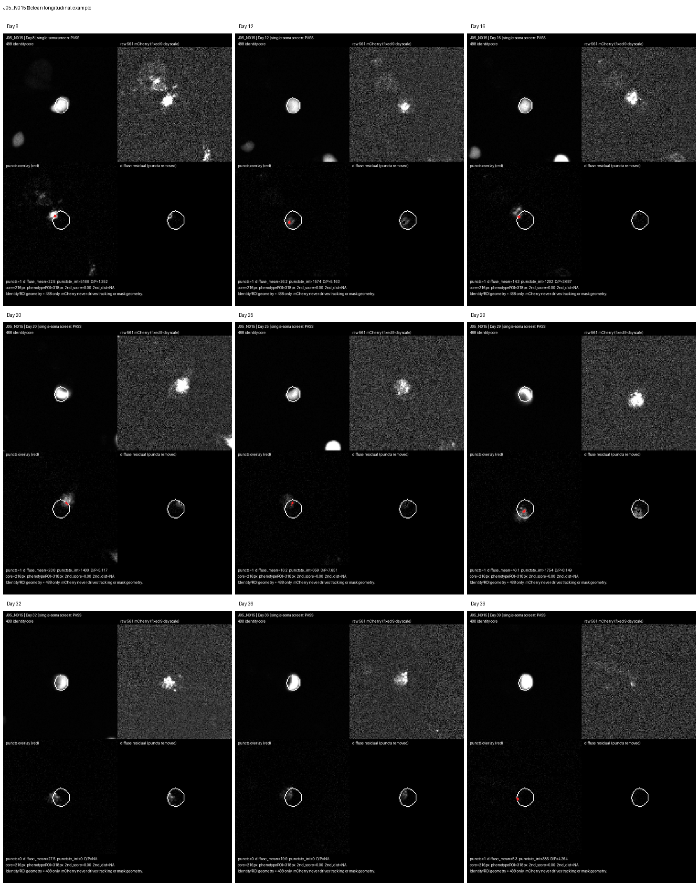
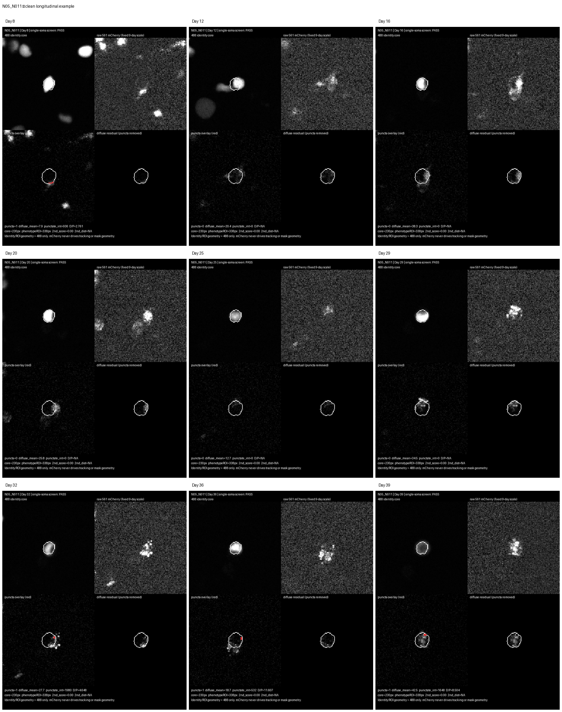
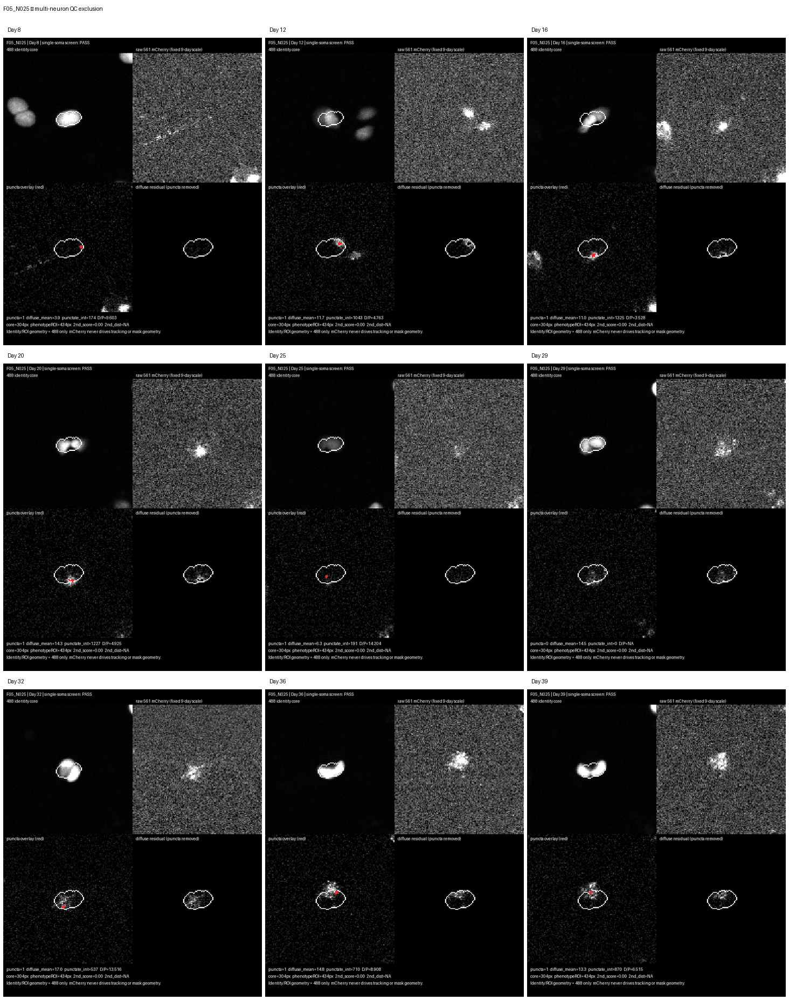

# TMEM106B Longitudinal Single-Neuron Analysis
## Curated Review — September 1, 2026

### Status

This project is currently at the internal review / method-validation stage.

The full v2 atlas contains 433 automatically detected candidate tracks. Manual review showed that automated tracking QC alone is not sufficient to establish longitudinal identity for every candidate, so the atlas is retained as a candidate-generation resource rather than interpreted as 433 validated neurons.

A high-quality subset was subsequently re-rendered with tighter 488-derived identity masks and explicit mCherry phenotype visualization.

### Experimental design

Six wells were followed across Days 8, 12, 16, 20, 25, 29, 32, 36, and 39.

Matched well pairs:

| Control | TMEM106B |
|---|---|
| E05 | F05 |
| I05 | J05 |
| M05 | N05 |

### Identity versus phenotype

Neuron identity and phenotype are intentionally separated.

- 488 nm defines longitudinal neuron identity, tracking, and ROI geometry.
- 561 nm / mCherry is used only for phenotype measurement.
- mCherry never drives tracking.

### Curated phenotype workflow

The current workflow:

1. Reuses the existing v2 longitudinal 488 anchors.
2. Keeps the 128 × 128 pixel crop unchanged.
3. Builds a tight longitudinal 488-derived identity core.
4. Uses approximately 60% longitudinal consensus for the identity core.
5. Expands that core slightly for phenotype measurement.
6. Screens for potential secondary somata.
7. Measures mCherry only inside the fixed phenotype ROI.
8. Explicitly renders:
   - 488 identity
   - raw 561/mCherry
   - detected puncta
   - diffuse/non-punctate residual
9. Performs manual visual QC.

### Representative clean examples

#### J05_N015

#### N05_N011

### Known QC exclusion

`F05_N025` remains well centered, but the ROI contains signal from more than one neuron. It is retained as a QC example rather than a valid single-neuron phenotype track.

### Phenotype measurements

Current primary measurements include:

- punctate mCherry integrated intensity
- total mCherry intensity
- diffuse mCherry mean intensity
- diffuse-to-punctate ratio
- puncta density per ROI area

Puncta are detected using a Difference-of-Gaussians approach with robust local thresholding.

The puncta/diffuse decomposition is a quantitative phenotype description and should not be interpreted as direct evidence of lysosomal rupture.

### Biological replication

Individual neurons provide longitudinal within-well measurements.

The biological replicate structure remains the three matched well pairs:

- E05 / F05
- I05 / J05
- M05 / N05

Neuron counts should therefore not be treated as independent biological replicate counts.

### Review package

The current internal review package contains:

- 24 primary longitudinal phenotype videos
- 1 separated QC-exclusion example
- manual review tables
- an exploratory atlas workbook
- analysis/QC documentation

Large imaging files and MP4 review files are intentionally not stored in Git.

For authorized WardLab users, the internal package is available through the WardLab Globus collection at:

`/data/WardLab/TMEM106B_neuron_atlas_review_ready_20260901/`

### Next analysis milestone

After review is finalized:

1. Freeze the manually accepted neuron list.
2. Rebuild longitudinal phenotype tables from the curated ROI measurements.
3. Recompute matched-pair trajectories using only validated neurons.
4. Regenerate the quantitative workbook from the curated dataset.
5. Use the three matched well pairs as the biological replicate structure.
